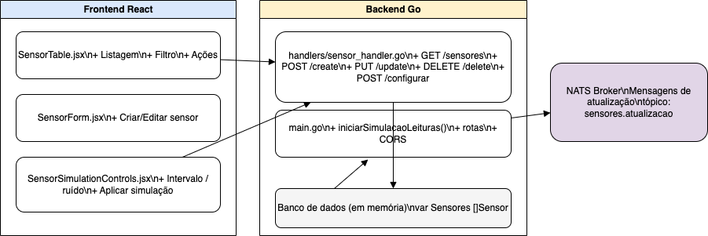

Claro, Hissi! Aqui está uma versão aprimorada e profissional do seu `README.md`, com correções de erros, melhorias de formatação e maior clareza geral:

---

# 🔧 Sensor Application — NATS, Go Backend & React + TailwindCSS Frontend

Aplicação simples de sensores utilizando comunicação assíncrona com **NATS**, backend em **Go**, e frontend em **React + TailwindCSS**.

---

## 📁 Project Structure

```
├── sensor-backend         # Backend in Go
│   ├── main.go            # Entry point
│   ├── handlers/          # HTTP handlers
│   ├── models/            # Data models
│   └── nats/              # NATS client setup
└── sensor-frontend        # Frontend in React with TailwindCSS
    └── src/components/    # UI Components
```

---

## 🚀 How to Run the Application

### 1️⃣ Start the NATS Server

#### ✅ Using Docker (recommended)

```bash
docker run -p 4222:4222 -p 8222:8222 nats:latest
```

* Port `4222`: used by the NATS client
* Port `8222`: used for monitoring (optional)

#### 🧪 Without Docker

Download and install the NATS server: [NATS Installation Guide](https://docs.nats.io/running-a-nats-service/introduction/installation)

Then run:

```bash
nats-server
```

---

### 2️⃣ Start the Backend (Go)

#### Prerequisites:

* Go 1.18 or higher

#### Steps:

```bash
cd sensor-backend
go mod download
```

Create a `.env` file or export the environment variables manually:

```bash
export NATS_URL=nats://localhost:4222
export PORT=8080
```

Start the backend:

```bash
go run main.go
```

> Backend will be available at: `http://localhost:8080`

---

### 3️⃣ Start the Frontend (React + TailwindCSS)

#### Prerequisites:

* Node.js 18+

#### Steps:

```bash
cd sensor-frontend
npm install
```

Create a `.env` file with the backend API URL:

```env
REACT_APP_BACKEND_URL=http://localhost:8080
```

Start the frontend:

```bash
npm start
```

> Frontend will be available at: `http://localhost:3000`

---

## 🛠️ Technologies Used

* **NATS** — Lightweight and fast messaging system (Pub/Sub)
* **Go (Golang)** — Efficient and scalable backend
* **React** — Modern frontend framework
* **TailwindCSS** — Utility-first CSS framework for responsive UIs

---

## 🧪 Testing

This project uses **Jest** and **React Testing Library** for unit testing.

### ▶️ Run Tests

```bash
npm test
```

### ✅ Run Tests with Coverage Report

```bash
npm test -- --coverage
```

A `coverage/` folder will be created with the full report.

### 🌐 Open Coverage Report in Browser

* On macOS or Linux:

  ```bash
  open coverage/lcov-report/index.html
  ```

* On Windows:

  ```bash
  start coverage/lcov-report/index.html
  ```

### 📦 Install Test Dependencies (if needed)

```bash
npm install --save-dev @testing-library/react @testing-library/jest-dom
```

Also, include the following line at the top of your `setupTests.js`:

```js
import '@testing-library/jest-dom';
```

---

## 💡 Notes

* Make sure NATS is running **before** starting the backend.
* The frontend communicates with the backend via **REST**, and the backend communicates with **NATS**.
* A `natsClient.js` example may exist in the frontend for testing, but production communication is handled via the backend.

---

## ✅ Features

* List and register sensors
* Real-time communication using NATS
* Fully responsive interface using TailwindCSS

---

## 🗺️ Architecture Diagram



---

## 📄 License

This project is licensed under the **MIT License**.

---
